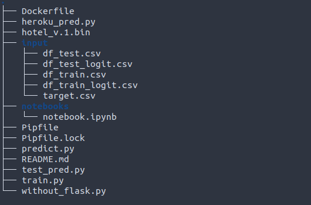

# Midterm Project - MLZoomcamp

## Dataset Kaggle Community prediction Competition

[hotel booking cancellations](https://www.kaggle.com/competitions/79-dapt-ih-hotel-booking/data)

## Source

[Hotel booking demand datasets]( https://www.sciencedirect.com/science/article/pii/S2352340918315191)

# Overview 

The 79 DAPT SAO IH Hotel Booking describes two datasets with hotel demand data. One of the hotels is a resort hotel and the other is a city hotel. Both datasets share the same structure. Each observation represents a hotel booking. Both datasets comprehend bookings due to arrive between the 1st of July of 2015 and the 31st of August 2017, including bookings that effectively arrived and bookings that were canceled.


## Attribute Information

| Name | Data Type | Description|
|:---|:---|:---|
| `hotel` | category | Type of hotel|
| `is_cancelled` | binary | Target Value indicating if the booking was canceled (1) or not (0)|
| `lead_time` | number | Number of days that elapsed between the entering date of the booking into the PMS and the arrival date|
| `stays_in_weekend_nights` | number | Number of weekend nights (Saturday or Sunday) the guest stayed or booked to stay at the hotel|
| `stays_in_week_nights` | number | Number of week nights (Monday to Friday) the guest stayed or booked to stay at the hotel|
| `adults` | number | Number of adults|
| `children` | number | Number of children|
| `babies` | number | Number of babies|
| `meal` | category | Type of meal booked|
| `country` | category | Country of origin|
| `market_segment` | category | Market segment designation|
| ` distribution_channel` |  category|Booking distribution channel |
| `is_repeated_guest` | binary |Value indicating if the booking name was from a repeated guest (1) or not (0) |
| `previous_cancellations` | number | Number of previous bookings that were cancelled by the customer prior to the current booking|
| `previous_bookings_not_canceled` | number | [Number of previous bookings not cancelled by the customer prior to the current booking|
| `reserved_room_type` | category | Code of room type reserved|
| `assigned_room_type` | category | Code for the type of room assigned to the booking|
| `booking_changes` | number | Number of changes/amendments made to the booking|
| `deposit_type` | category | Indication on if the customer made a deposit to guarantee the booking|
| `agent` | category | ID of the travel agency that made the booking|
| `company` | category |ID of the company/entity that made the booking or responsible for paying the booking. ID is presented instead of designation for anonymity reasons |
| `days_in_waiting_list` | number | Number of days the booking was in the waiting list before it was confirmed to the customer|
| `customer_type` |category  | Type of booking|
| `adr` | number | Average Daily Rate calculated by dividing the sum of all lodging transactions by the total number of staying nights|
| `required_car_parking_spaces` | number | [Number of car parking spaces required by the customer|
| `total_of_special_requests` | number |Number of special requests made by the customer |
| `reservation_status_date` | date | Date at which the last status was set|
| `arrival_date` | date | Date of arrival|
| `id_booking ` |  number| ID of booking|

## Problem Statement
Booking cancellations often directly impact a hotel's bottom line: many times the room(s) reserved are not booked again, resulting in lower occupation and, subsequently, revenue. To hedge this risk, hotels often demand a booking deposit, often calculated as a percentage of the reservations full price. However, this practice can directly impact demand as some customers might look for different hotels with no deposit (or a smaller one). **Our goal is to build a model that, by predicting whether a booking will be cancelled or not, can be used by the hotel to implement different risk-aware strategies for calculating the deposit size**.

## Contents of the folder 



The `input` folder contains only the cleaned dataset. For original datset please refer to the notebook.

The `notebook` folder contains the [notebook.ipynb](notebooks/notebook.ipynb) Which contains **EDA** and **Feature enginnering**.

The model is fitted with clean data in [train.py](train.py).

  
## Deployment of model

 I am using Flask/gunicorn on linux ubuntu, in order to deploy the model. To deploy this model with Flask/gunicorn, please use:
  ```console
  pipenv run gunicorn --bind 0.0.0.0:9696 predict:app
  ```

## Virtual Environment/venv 

I used pipenv for the virtual environment. In order to use the same venv as me, do use: 
```console 
pip install pipenv
```

To replicate the environment, on your command line, use 
```console
pipenv install numpy pandas scikit-learn flask gunicorn requests
```
**Note**:  
If you want to train the `xgboost` model instead of `Histogram Gradient Boosting `  please add `xgboost` as command on pipenv installation.
## Docker

**Note**:  
To perform the following steps you should logon to your DockerHub Account ( `Logi & Password`)

I have built the model and pushed it to [dajebbar/hotel-booking-model:latest](https://hub.docker.com/r/dajebbar/hotel-booking-model). 
To use it just 
```console
docker pull dajebbar/hotel-booking-model:latest
```

Or in order to take the model from the docker container I built, just replace 
```Dockerfile
FROM python:3.9-slim 

#with 

FROM dajebbar/hotel-booking-model:latest in the dockerfile.
```

If you choose to build a docker file locally instead, here are the steps to do so:
1. Create a Dockerfile as such:
```Dockerfile
FROM python:3.9-slim

ENV PYTHONUNBUFFERED=TRUE

RUN pip --no-cache-dir install pipenv

WORKDIR /app

COPY ["Pipfile", "Pipfile.lock", "./"]

RUN pipenv install --deploy --system && rm -rf /root/.cache

COPY ["predict.py", "*.bin", "./"]

EXPOSE $PORT

CMD gunicorn --workers=4 --bind 0.0.0.0:$PORT predict:app
```

This allows us to `install python, run pipenv and its dependencies, run our predict script and our model itself and deploys our model using Flask/gunicorn`.

Similarly, you can just use the dockerfile in this repository.

2. Build the Docker Container with :
```console
 docker build -t hotel-booking-model .
 ```

3. Run the Docker container with:

```console
Docker run -it -p 9696:9696 docker build -t hotel-booking-model
```

Now we can use our model through 
```console
python test_pred.py
```

4. tag the docker container with:

```console

docker tag hotel-booking-model dajebbar/hotel-booking-model:latest

```
5. Push it Docker registry with :

```console
docker push dajebbar/hotel-booking-model:latest

```

## Heroku
In order to deploy this model on heroku cloud server, here are the steps to follow:  
- Create a new `.github` folder in the parent folder, then in the latter, create another `workflows` folder, you can do it easily using the linux command:
```console
touch .github/workflows
```
- in the `workflows` folder, create the main.yaml file, which is responsible for auto-reading the `Dockerfile` file once you **push** it to github. Here is its content:
```yaml
# Your workflow name.
name: Deploy to heroku.

# Run workflow on every push to main branch.
on:
  push:
    branches: [main]

# Your workflows jobs.
jobs:
  build:
    runs-on: ubuntu-latest
    steps:
      # Check-out your repository.
      - name: Checkout
        uses: actions/checkout@v2


### ⬇ IMPORTANT PART ⬇ ###

      - name: Build, Push and Release a Docker container to Heroku. # Your custom step name
        uses: gonuit/heroku-docker-deploy@v1.3.3 # GitHub action name (leave it as it is).
        with:
          # Below you must provide variables for your Heroku app.

          # The email address associated with your Heroku account.
          # If you don't want to use repository secrets (which is recommended) you can do:
          # email: my.email@example.com
          email: ${{ secrets.HEROKU_EMAIL }}
          
          # Heroku API key associated with provided user's email.
          # Api Key is available under your Heroku account settings.
          heroku_api_key: ${{ secrets.HEROKU_API_KEY }}
          
          # Name of the heroku application to which the build is to be sent.
          heroku_app_name: ${{ secrets.HEROKU_APP_NAME }}

          # (Optional, default: "./")
          # Dockerfile directory.
          # For example, if you have a Dockerfile in the root of your project, leave it as follows:
          dockerfile_directory: ./

          # (Optional, default: "Dockerfile")
          # Dockerfile name.
          dockerfile_name: Dockerfile

          # (Optional, default: "")
          # Additional options of docker build command.
          docker_options: "--no-cache"

          # (Optional, default: "web")
          # Select the process type for which you want the docker container to be uploaded.
          # By default, this argument is set to "web".
          # For more information look at https://devcenter.heroku.com/articles/process-model
          process_type: web
```
- Then, go to github, open the folder
`hotel_booking_project` then click on `Settings`, go to `Secrets` then click on `Actions`, then click on the button `New repository secret`. On the `Name` field type `HEROKU_EMAIL` , below there is the `Secret` field, enter your email which serves as your identifier on `Heroku`. After confirming by clicking on the `Add secret` button, you must repeat the same manipulation this time type `HEROKU_API_KEY` as name, and go to the `Heroku` platform, go to `Accounts settings` then go down to the `API Key` field then click on the `Reveal` button copy-paste your `API Key` into the `Secret` field in github. The same manipulation this time on the `Name` field type
`HEROKU_APP_NAME` and in the `Secret` field type the name you gave to your application on `Heroku`, in my case it is called `hotelbooking-api`. Once saved, go back to your `.github` folder, open the console, type:
```console
git add .
git commit -m "your comment"
git push main origin
```
And now, when you refresh your github page, a small yellow dot will appear next to the folder name, click on commits to see the automatic execution of the `Dockerfile` file with all its dependencies. Return to the `Heroku` platform, press the `Open app` button and voila.

## Test the project
The project is now deployed on [heroku cloud servers](https://hotelbooking-api.herokuapp.com/) and to test it just run the file [heroku_pred.py](heroku_pred.py).

# Want to Contribute?
* Fork 🍴 the repository and send PRs.
* Do ⭐ this repository if you like the content.

**Connect with me:**

<p align="center">
  <a href="https://ma.linkedin.com/in/abdeljebbar-boubekri-656b30192" target="blank"></a>
  <a href="https://www.twitter.com/marokart/" target="blank"></a>
  <a href="http://dajebbar.free.fr" target="blank">
    </a>
  
</p>


